```mermaid
flowchart TB
    App["💻 Local app<br/>127.0.0.1:PORT"]

    subgraph client["expose client"]
        Fwd["Forward"] --> Conn["Connect"] --> Reg["Register"]
    end

    subgraph server["expose server"]
        Hub{{"Session hub"}}
        Route["Route by hostname"]
        TLS["TLS · WAF"]
        DB[("SQLite")]

        Hub --> Route --> TLS
        Route -. resolve .-> DB
    end

    Browser["🌐 Browser"]

    App -- "HTTP" --> Fwd
    Hub <-- "WebSocket tunnel" --> Conn
    Conn -- "token" --> Hub
    Reg -- "API key" --> Route
    TLS -- "HTTPS *.domain" --> Browser
```

# expose

**expose** is a self-hosted HTTP tunnel. Run your own server, then expose local HTTP ports from any machine - no third-party services required.


## Features

- **HTTPS-only** public traffic with automatic TLS (ACME) or static wildcard certificates
- **Built-in WAF** blocks SQL injection, XSS, path traversal, and other attacks before they reach your app
- **Static site publishing** via `expose static` for quick docs, SPAs, and local folders
- **Multi-route configs** via `expose.yml` - expose multiple services under one subdomain with path-based routing
- **Real-time client dashboard** with request log, latency percentiles, WAF counters, and connection stats
- **Auto-update** - server and client can self-update in the background with zero downtime
- **Password-protected tunnels** with HTTP Basic Auth (per-tunnel or per-config)
- **Env-first configuration** - minimal CLI flags, `.env` support, and interactive setup wizards
- **Rate limiting** on tunnel registration to prevent abuse
- **Persistent login** - authenticate once with `expose login`, credentials are saved locally
- **Automatic reconnection** with exponential backoff and keepalive pings

## How It Works



1. The **server** terminates TLS, runs WAF inspection, and routes requests by hostname to the correct tunnel
2. The **client** registers via API key, opens a persistent WebSocket, and proxies requests to your local port
3. Requests and responses flow over the WebSocket as JSON envelopes with binary streaming for large bodies

For the full request lifecycle and component breakdown, see [Architecture Overview](docs/architecture-overview.md).

## Quick Start

### Prerequisites

- A **server or VPS** with a public IP - or a home server with [port forwarding](docs/port-forwarding.md) configured
- A **domain** you control (e.g. `example.com`)
- A **DNS wildcard A record** (`*.example.com`) pointing to your server's public IP

### 1. Install

Download the latest binary from [Releases](https://github.com/koltyakov/expose/releases) and place it in your `PATH`.

### 2. Server - init and run

On your public-facing machine, run the interactive setup (writes a `.env` for you):

```bash
expose server init   # guided setup
expose server        # start the tunnel server
```

Then create an API key for your client(s):

```bash
expose apikey create --name default
```

### 3. Client - login and run

On any machine you want to expose:

```bash
# Login once to save credentials locally
expose login

# Expose a local HTTP port (e.g. 3000) to the internet
expose http 3000

# Or expose a static directory as a website
expose static
```

Open the URL shown in the terminal - that's it.

> Security notice: if your server is using per-host ACME certificates
> (`dynamic`, or `auto` without a matching wildcard certificate), new public
> hostnames are often discovered and probed by bots shortly after they are
> created. Protect new tunnels immediately and use `--protect` for anything
> non-public. See [TLS Modes](docs/tls-modes.md) and [Static Sites](docs/static-sites.md).

For the full walkthrough, DNS setup guides, and multi-route configs, see [Quick Start](docs/quick-start.md).

## Documentation

See the [docs/](docs/README.md) folder for all guides - server & client configuration, [static sites](docs/static-sites.md), TLS modes, DNS setup, deployment, WAF, auto-update, troubleshooting, and more.

## Acknowledgements

- [ngrok](https://ngrok.com/) - the gold standard for HTTP tunnels and a huge inspiration. `expose` exists because I needed more freedom and control over infrastructure, but ngrok paved the way.
- [OpenAI](https://openai.com/) and [Anthropic](https://anthropic.com/) - AI-assisted development boosted the entire build lifecycle by 10×.

## License

MIT
