```mermaid
flowchart TB
    App["💻 Local app<br/>127.0.0.1:PORT"]

    subgraph client["expose client"]
        Fwd["Forward"] --> Conn["Connect"] --> Reg["Register"]
    end

    subgraph server["expose server"]
        Hub{{"Session hub"}}
        Route["Route by hostname"]
        TLS["TLS · WAF"]
        DB[("SQLite")]

        Hub --> Route --> TLS
        Route -. resolve .-> DB
    end

    Browser["🌐 Browser"]

    App -- "HTTP" --> Fwd
    Hub <-- "WebSocket tunnel" --> Conn
    Conn -- "token" --> Hub
    Reg -- "API key" --> Route
    TLS -- "HTTPS *.domain" --> Browser
```

# expose

**expose** is a self-hosted HTTP tunnel. Run your own server, then expose local HTTP ports from any machine — no third-party services required.


## Features

- **HTTPS-only** public traffic with automatic TLS (ACME) or static wildcard certificates
- **Built-in WAF** blocks SQL injection, XSS, path traversal, and other attacks before they reach your app
- **Multi-route configs** via `expose.yml` — expose multiple services under one subdomain with path-based routing
- **Real-time client dashboard** with request log, latency percentiles, WAF counters, and connection stats
- **Auto-update** — server and client can self-update in the background with zero downtime
- **Password-protected tunnels** with HTTP Basic Auth (per-tunnel or per-config)
- **Env-first configuration** — minimal CLI flags, `.env` support, and interactive setup wizards
- **Rate limiting** on tunnel registration to prevent abuse
- **Persistent login** — authenticate once with `expose login`, credentials are saved locally
- **Automatic reconnection** with exponential backoff and keepalive pings

## How It Works



1. The **server** terminates TLS, runs WAF inspection, and routes requests by hostname to the correct tunnel
2. The **client** registers via API key, opens a persistent WebSocket, and proxies requests to your local port
3. Requests and responses flow over the WebSocket as JSON envelopes with binary streaming for large bodies

For the full request lifecycle and component breakdown, see [Architecture Overview](docs/architecture-overview.md).

## Quick Start

```bash
# Build
go build -o bin/expose ./cmd/expose

# 1. Start server (interactive setup writes .env for you)
expose server init

# 2. Create an API key
expose apikey create --name default

# 3. Login from client machine (once)
expose login --server example.com --api-key <KEY>

# 4. Expose a local port
expose http 3000
```

That's it — open the URL shown in the terminal. For the full walkthrough, see [Quick Start](docs/quick-start.md).

## CLI Commands

| Command                              | Description                           |
| ------------------------------------ | ------------------------------------- |
| `expose http <port>`                 | Expose local port (temporary subdomain) |
| `expose http --domain=myapp <port>`  | Expose with a named subdomain         |
| `expose http --protect <port>`       | Expose with password protection       |
| `expose up`                          | Start routes from `expose.yml`        |
| `expose up init`                     | Create `expose.yml` via guided wizard |
| `expose login`                       | Save server URL and API key           |
| `expose server`                      | Start tunnel server                   |
| `expose server init`                 | Guided server setup + `.env` write    |
| `expose apikey create --name NAME`   | Create a new API key                  |
| `expose apikey list`                 | List all API keys                     |
| `expose apikey revoke --id=ID`       | Revoke an API key                     |
| `expose update`                      | Update to the latest release          |
| `expose version`                     | Print version                         |

## Documentation

See the [docs/](docs/README.md) folder for all guides — server & client configuration, TLS modes, DNS setup, deployment, WAF, auto-update, troubleshooting, and more.

## License

MIT
