# expose

**expose** is a BYOI (Bring Your Own Infrastructure) HTTP tunnel.
Run your own server, then expose local HTTP ports from any client machine - no third-party services required.


## Features

- **HTTPS-only** public traffic with automatic TLS (ACME) or static wildcard certs.
- **Env-first** configuration - minimal CLI flags needed.
- Client `login` persists credentials so you authenticate once:
  | OS | Path |
  |---|---|
  | Windows | `%USERPROFILE%\.expose\settings.json` |
  | Linux / macOS | `~/.expose/settings.json` |
- Single domain parameter: `EXPOSE_DOMAIN` (e.g. `example.com`).

## Architecture Overview

```mermaid
flowchart TB
    App["💻 Local app<br/>127.0.0.1:PORT"]

    subgraph client["expose client"]
        Fwd["Forward"] --> Conn["Connect"] --> Reg["Register"]
    end

    subgraph server["expose server"]
        Hub{{"Session hub"}}
        Route["Route by hostname"]
        TLS["TLS · WAF"]
        DB[("SQLite")]

        Hub --> Route --> TLS
        Route -. resolve .-> DB
    end

    Browser["🌐 Browser"]

    App -- "HTTP" --> Fwd
    Hub <-- "WebSocket tunnel" --> Conn
    Conn -- "token" --> Hub
    Reg -- "API key" --> Route
    TLS -- "HTTPS *.domain" --> Browser
```



### Request lifecycle

1. **TLS termination** — the server terminates HTTPS using ACME (auto/dynamic per-host) or a static wildcard certificate.
2. **WAF** — every inbound request passes the Web Application Firewall, which blocks common attack patterns (SQLi, XSS, path traversal, shell injection, scanner bots) and returns `403` on match.
3. **Routing** — the server mux dispatches to one of three handlers:
   - `/v1/tunnels/register` — the client authenticates with an API key (SHA-256 + pepper), a hostname is allocated, and a one-time connect token is returned.
   - `/v1/tunnels/connect` — the client exchanges the token for a persistent WebSocket session stored in the in-memory session hub.
   - `/*` (public) — incoming requests are resolved to a tunnel via a hostname route cache (backed by SQLite), optionally authorized with Basic Auth (bcrypt), then forwarded to the matching WebSocket session.
4. **Tunnel protocol** — requests and responses flow over the WebSocket as JSON envelopes. Large bodies are streamed as binary frames. Full WebSocket relay (open/data/close) is also supported.
5. **Client proxy** — the client deserializes each forwarded request, issues it against `127.0.0.1:PORT`, and sends the response back through the tunnel.
6. **Reliability** — the client sends keepalive pings and reconnects with exponential backoff; the server runs a background janitor that expires stale sessions, purges unused temporary domains, and cleans up old cert cache entries.

## Installation

Build from source (requires Go 1.23+):

```bash
go build -o bin/expose ./cmd/expose
```

This produces `./bin/expose`. All examples below use `expose` - substitute with the full path to the binary if it is not in your `PATH`.

## Defaults

| Setting             | Default       | Env override                   |
| ------------------- | ------------- | ------------------------------ |
| HTTPS listen        | `:10443`      | `EXPOSE_LISTEN_HTTPS`          |
| ACME HTTP-01 listen | `:10080`      | `EXPOSE_LISTEN_HTTP_CHALLENGE` |
| SQLite DB           | `./expose.db` | `EXPOSE_DB_PATH`               |
| Cert cache          | `./cert`      | `EXPOSE_CERT_CACHE_DIR`        |

If you run behind Docker, NAT, or a router, forward:

- `443 -> 10443` (TCP)
- `80 -> 10080` (TCP)

## DNS Setup (`@` and `*` A records)

Create DNS records for your `EXPOSE_DOMAIN` zone before starting clients:

- `A` record `@` -> your server public IPv4
- `A` record `*` -> your server public IPv4

Notes:

- `@` covers the apex domain (`example.com`).
- `*` covers dynamic subdomains (`<anything>.example.com`).
- Dynamic ACME (`EXPOSE_TLS_MODE=auto|dynamic`) needs public reachability on ports `80` and `443`.

## Quick Start

Interactive setup (recommended):

```bash
expose server wizard
```

The wizard asks for server parameters with defaults, writes `.env`, and can generate an API key.

### 1. Configure server env

```bash
export EXPOSE_DOMAIN=example.com
export EXPOSE_TLS_MODE=auto
```

Optional:

```bash
export EXPOSE_DB_PATH=./expose.db
export EXPOSE_CERT_CACHE_DIR=./cert
export EXPOSE_API_KEY_PEPPER=...
```

If `EXPOSE_API_KEY_PEPPER` is unset and no machine-id is available, server initializes with an empty pepper.

### 2. Start server

```bash
expose server
```

### 3. Create API key

```bash
expose apikey create --name default
```

Copy `api_key` from output.

### 4. Login client once

```bash
expose login --server <example.com> --api-key <api_key>
```

If `--server` or `--api-key` is omitted in an interactive shell, `expose login` prompts for missing values.

In CI/non-interactive runs, pass both flags to avoid prompts.

### 5. Expose local app port

```bash
expose http 3000
```

`--server` and `--api-key` are optional after login (stored settings are used). You can still pass them to override.

Named tunnel example:

```bash
expose http --domain=myapp 8080
```

This requests `https://myapp.<EXPOSE_DOMAIN>`.

## CLI Reference

Run `expose help` (or `expose --help`) for the full command list.

```text
expose http <port>                       Expose local port (temporary subdomain)
expose http --domain=myapp <port>        Expose with a named subdomain
expose login                             Save server URL and API key
expose server                            Start tunnel server
expose server wizard                     Guided server setup + .env write
expose apikey create --name NAME         Create API key
expose apikey list                       List API keys
expose apikey revoke --id=ID             Revoke API key
expose version                           Print version
```

### Client flags

| Flag        | Env                | Description                                |
| ----------- | ------------------ | ------------------------------------------ |
| `--port`    | `EXPOSE_PORT`      | Local HTTP port on 127.0.0.1 (required)    |
| `--domain`  | `EXPOSE_SUBDOMAIN` | Requested subdomain (e.g. `myapp`)         |
| `--server`  | `EXPOSE_DOMAIN`    | Server URL (HTTPS)                         |
| `--api-key` | `EXPOSE_API_KEY`   | API key                                    |
| `--protect` | -                  | Enable password protection for this tunnel |

**Examples:**

```bash
expose http 3000                      # temporary random subdomain
expose http --domain=myapp 3000       # named: https://myapp.<EXPOSE_DOMAIN>
```

Protected tunnel (interactive prompt):

```bash
expose http --domain=myapp --protect 3000
```

Protected tunnel (no prompt):

```bash
EXPOSE_USER=admin EXPOSE_PASSWORD=secret expose http --domain=myapp 3000
```

For full local single-machine E2E instructions (`127.0.0.1.sslip.io` + protected tunnel), see [Local Testing](docs/local-testing.md).

Default mode is temporary. If `--domain` is not set, host allocation is automatic:

- Wildcard TLS active: randomized temporary host (6-char slug) is allocated.
- Wildcard TLS not active: server first tries a deterministic host from `client_hostname + ":" + local_port`:
  - `sha1(client_hostname:local_port)` -> base32 lowercase -> first 6 chars
  - example shape: `k3xnz3.example.com`
  - on collision, server falls back to randomized 6-char host

Why randomization exists:

- avoids users accidentally claiming memorable names in temporary mode
- reduces hostname collisions across clients
- keeps temporary endpoints disposable

### Server flags

| Flag                      | Env                            | Default       | Description                |
| ------------------------- | ------------------------------ | ------------- | -------------------------- |
| `--domain`                | `EXPOSE_DOMAIN`                | _(required)_  | Public base domain         |
| `--listen`                | `EXPOSE_LISTEN_HTTPS`          | `:10443`      | HTTPS listen address       |
| `--http-challenge-listen` | `EXPOSE_LISTEN_HTTP_CHALLENGE` | `:10080`      | ACME challenge listener    |
| `--db`                    | `EXPOSE_DB_PATH`               | `./expose.db` | SQLite DB path             |
| `--tls-mode`              | `EXPOSE_TLS_MODE`              | `auto`        | `auto\|dynamic\|wildcard`  |
| `--cert-cache-dir`        | `EXPOSE_CERT_CACHE_DIR`        | `./cert`      | Cert cache directory       |
| `--tls-cert-file`         | `EXPOSE_TLS_CERT_FILE`         | -             | Static cert PEM (wildcard) |
| `--tls-key-file`          | `EXPOSE_TLS_KEY_FILE`          | -             | Static key PEM (wildcard)  |
| `--api-key-pepper`        | `EXPOSE_API_KEY_PEPPER`        | -             | Explicit pepper override   |
| `--log-level`             | `EXPOSE_LOG_LEVEL`             | `info`        | `debug\|info\|warn\|error` |
| -                         | `EXPOSE_WAF_ENABLE`            | `true`        | Enable/disable the WAF     |

## Wildcard TLS Mode

Use `EXPOSE_TLS_MODE=wildcard` to serve `example.com` and `*.example.com` from one static wildcard cert.

When to use wildcard mode:

- you expect many short-lived temporary subdomains
- you want to avoid frequent per-host certificate issuance
- you want predictable TLS behavior across many rotating hosts

If wildcard cert files are missing, server prints a concrete Let's Encrypt DNS-01 walkthrough and exits:

- required SANs
- expected file locations
- certbot command shape

Dynamic per-host ACME is available in `auto` / `dynamic` and is best for simpler setups with low tunnel churn.

## Web Application Firewall (WAF)

The server includes a built-in WAF that blocks common attack patterns **before** they reach your local app. It is **enabled by default**.

Protected against:

- SQL injection, XSS, path traversal
- Shell injection, Log4Shell / JNDI
- Scanner bots (sqlmap, nikto, nuclei, …)
- Sensitive file probes (`.env`, `.git/`, `/etc/passwd`, …)
- Header injection (CRLF) and protocol attacks

Blocked requests receive `403 Forbidden` and are logged server-side. The client dashboard shows a real-time **WAF blocked** counter and a `(+WAF)` indicator next to the server version.

To disable:

```bash
export EXPOSE_WAF_ENABLE=false
```

For the full ruleset and architecture details, see [WAF documentation](docs/waf.md).

## Internal Reliability Behavior

- Client sends keepalive pings automatically.
- Client reconnects with backoff if server/session drops.
- Server expires stale sessions and closes stale temporary tunnels.
- Stale temporary domains and old temporary cert cache files are purged automatically.
- Server persists a single effective API-key pepper in DB (`server_settings`) so restarts/container moves do not break existing keys.
