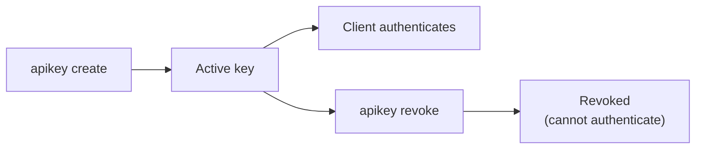

# API Key Management

expose uses API keys to authenticate clients. Keys are created on the server and stored as SHA-256 hashes.

## Lifecycle



## Create a key

```bash
expose apikey create --name my-laptop
```

Output:

```
api_key: <RANDOM_KEY>
id:      <KEY_ID>
name:    my-laptop
```

> **Copy the `api_key` immediately** - it is shown only once. The server stores a salted hash, not the raw key.

## List keys

```bash
expose apikey list
```

Shows all keys with their ID, name, creation date, and revocation status.

## Revoke a key

```bash
expose apikey revoke --id=<KEY_ID>
```

Revoked keys are rejected immediately. Active tunnels using a revoked key will fail on next reconnect.

## Client login

Save credentials locally so you don't need `--api-key` on every command:

```bash
expose login --server example.com --api-key <KEY>
```

Credentials are stored in:

| OS            | Path                                  |
| ------------- | ------------------------------------- |
| macOS / Linux | `~/.expose/settings.json`             |
| Windows       | `%USERPROFILE%\.expose\settings.json` |

File permissions are set to `0600` (owner-only read/write).

## Pepper

The server hashes API keys with a pepper for additional security:

- Set `EXPOSE_API_KEY_PEPPER` env var to use a specific pepper
- If unset, the server **derives a pepper from `/etc/machine-id`** (Linux) via `sha256("expose-pepper:" + machine-id)`
- If neither env var nor machine-id is available, the server initializes with an empty pepper
- The effective pepper is **persisted in the SQLite database** (`server_settings` table) on first run
- Changing the pepper **invalidates all existing keys**

> **Warning - server migration**: Because the auto-derived pepper is tied to `/etc/machine-id`, moving the database file to a different machine will cause a pepper mismatch error on startup. The new machine derives a different pepper, but the DB already stores the original one. **Always set `EXPOSE_API_KEY_PEPPER` explicitly** if you plan to migrate, back up, or run in containers.

```bash
# Generate a pepper once, store it securely
openssl rand -hex 32

# Set it before starting the server
export EXPOSE_API_KEY_PEPPER=<generated-value>
```

## Best Practices

- Create **one key per client device** for easy revocation
- Use descriptive `--name` values (e.g. `andrews-macbook`, `ci-runner`)
- Revoke keys immediately when a device is lost or decommissioned
- **Always set `EXPOSE_API_KEY_PEPPER` explicitly** in production - the auto-derived pepper is tied to `/etc/machine-id` and will differ across machines, containers, or VPS reprovisions
