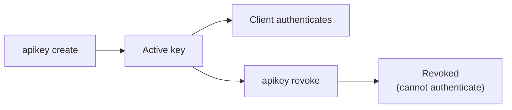

# API Key Management

expose uses API keys to authenticate clients. Keys are created on the server and stored as SHA-256 hashes.

## Lifecycle


```mermaid
flowchart LR
    Create["apikey create"] --> Active["Active key"]
    Active --> Use["Client authenticates"]
    Active --> Revoke["apikey revoke"]
    Revoke --> Revoked["Revoked<br/>(cannot authenticate)"]
```

## Create a key

```bash
expose apikey create --name my-laptop
```

API-key administration uses `EXPOSE_DB_PATH` from the process environment or
`./expose.db` by default. These commands do not load the server's `.env` file;
when running outside its working directory, pass the database explicitly:

```bash
expose apikey create --db /opt/expose/expose.db --name my-laptop
```

`create` also accepts `--api-key-pepper` when the server uses an explicitly
managed pepper. It must match the value already persisted in that database.

Output:

```
api_key: <RANDOM_KEY>
id:      <KEY_ID>
name:    my-laptop
tunnel_limit: 50
```

> **Copy the `api_key` immediately** - it is shown only once. The server stores a peppered hash, not the raw key.

New keys default to at most **50 concurrent tunnels**. To choose a different limit:

```bash
expose apikey create --name ci-runner --tunnel-limit 3
```

## Set tunnel limit

Update the maximum concurrent tunnels for an existing key:

```bash
expose apikey set-limit --id=<KEY_ID> --tunnel-limit 10
```

Use `--tunnel-limit -1` to remove the limit (unlimited).

## List keys

```bash
expose apikey list
```

Shows all keys with their ID, name, creation date, and revocation status.

## Revoke a key

```bash
expose apikey revoke --id=<KEY_ID>
```

Revoked keys and unused connect tokens issued to them are rejected immediately.
The running server checks connected sessions on each heartbeat sweep (30
seconds by default) and terminates tunnels owned by revoked keys.

## Client login

Save credentials locally so you don't need `--api-key` on every command:

```bash
expose login --server example.com --api-key <KEY>
```

Credentials are stored in:

| OS            | Path                                  |
| ------------- | ------------------------------------- |
| macOS / Linux | `~/.expose/settings.json`             |
| Windows       | `%USERPROFILE%\.expose\settings.json` |

File permissions are set to `0600` (owner-only read/write).

## Pepper

The server hashes API keys with a pepper for additional security:

- If the database has no pepper and `EXPOSE_API_KEY_PEPPER` is unset, the server generates a cryptographically random pepper on first use
- The effective pepper is persisted in SQLite's `server_settings` table and reused on later starts
- Set `EXPOSE_API_KEY_PEPPER` to provide a specific pepper; on first use it is persisted in the same way
- Once a pepper is persisted, any configured `EXPOSE_API_KEY_PEPPER` must match it exactly or the server refuses to start

The pepper travels with the SQLite database, so moving or restoring the database does not require machine-specific migration steps. If you configure the pepper externally, keep that configuration synchronized with the database backup.

```bash
# Generate a pepper once, store it securely
openssl rand -hex 32

# Set it before starting the server
export EXPOSE_API_KEY_PEPPER=<generated-value>
```

## Best Practices

- Create **one key per client device** for easy revocation
- Use descriptive `--name` values (e.g. `andrews-macbook`, `ci-runner`)
- Revoke keys immediately when a device is lost or decommissioned
- Back up the SQLite database, which contains the persisted pepper needed to verify existing keys
- If you set `EXPOSE_API_KEY_PEPPER` explicitly, keep it stable and ensure it matches the persisted value
