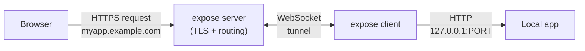
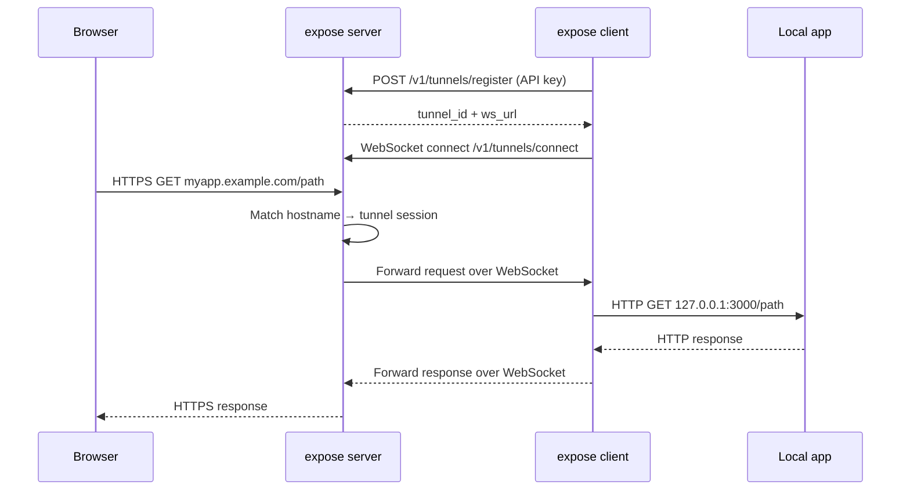

# Architecture Overview

How **expose** routes public HTTPS traffic to your local machine through a WebSocket tunnel.

## High-Level Flow

## Request Lifecycle

## Components

| Component          | Role                                                                          |
| ------------------ | ----------------------------------------------------------------------------- |
| **Server**         | Terminates TLS, manages ACME certs, authenticates clients, routes by hostname |
| **Client**         | Registers tunnel, holds WebSocket, proxies requests to local port             |
| **Store (SQLite)** | Persists API keys, domains, tunnel state                                      |
| **Hub**            | In-memory map of active WebSocket sessions for fast hostname lookup           |
| **WAF**            | Blocks SQL injection, XSS, path traversal, and other attacks before proxying ([details](waf.md)) |

## Tunnel Types

| Type          | Hostname                                               | Lifetime                                       |
| ------------- | ------------------------------------------------------ | ---------------------------------------------- |
| **Temporary** | Auto-generated 6-char slug (e.g. `k3xnz3.example.com`) | Cleaned up after disconnect + retention period |
| **Named**     | User-chosen (e.g. `myapp.example.com`)                 | Persists across reconnects                     |

## Forwarded Headers

The server injects standard reverse-proxy headers before forwarding requests through the tunnel, so your local app can see the real client information:

| Header              | Value                                                        |
| ------------------- | ------------------------------------------------------------ |
| `X-Forwarded-For`   | Original client IP (appended to existing chain if present)   |
| `X-Forwarded-Proto` | `https` (the protocol used by the public request)            |
| `X-Forwarded-Host`  | Public hostname (e.g. `myapp.example.com`)                   |
| `X-Forwarded-Port`  | Public port (e.g. `443`)                                     |
| `Host`              | Rewritten to match the public hostname                       |

Any pre-existing values for these headers in the incoming request are replaced to prevent spoofing.

## Security

- Built-in **Web Application Firewall** blocks common attack patterns (enabled by default)
- WAF-blocked request counts are streamed to the client dashboard in real time
- See the dedicated [WAF documentation](waf.md) for the full ruleset and configuration

## Reliability

- Client sends periodic **keepalive pings** over WebSocket
- Server **expires stale sessions** via background janitor
- Client **auto-reconnects** with exponential backoff on disconnect
- Temporary domains and stale cert cache entries are **purged automatically**
