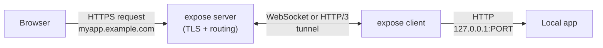
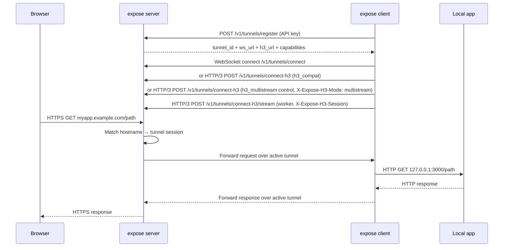

# Architecture Overview

How **expose** routes public HTTPS traffic to your local machine through a tunnel transport. The client-server tunnel can run over WebSocket or HTTP/3, but both transports now use the same versioned binary frame codec and shared write-path semantics.

## High-Level Flow

```mermaid
flowchart LR
    Browser["Browser"] -- "HTTPS request<br/>myapp.example.com" --> Server
    Server["expose server<br/>(TLS + routing)"] -- "WebSocket or HTTP/3<br/>tunnel" <--> Client["expose client"]
    Client -- "HTTP<br/>127.0.0.1:PORT" --> App["Local app"]
```

## Request Lifecycle

```mermaid
sequenceDiagram
    participant B as Browser
    participant S as expose server
    participant C as expose client
    participant A as Local app

    C->>S: POST /v1/tunnels/register (API key)
    S-->>C: tunnel_id + ws_url + h3_url + capabilities
    C->>S: WebSocket connect /v1/tunnels/connect
    C->>S: or HTTP/3 POST /v1/tunnels/connect-h3 (h3_compat)
    C->>S: or HTTP/3 POST /v1/tunnels/connect-h3 (h3_multistream control, X-Expose-H3-Mode: multistream)
    C->>S: HTTP/3 POST /v1/tunnels/connect-h3/stream (worker, X-Expose-H3-Session)

    B->>S: HTTPS GET myapp.example.com/path
    S->>S: Match hostname → tunnel session
    S->>C: Forward request over active tunnel
    C->>A: HTTP GET 127.0.0.1:3000/path
    A-->>C: HTTP response
    C-->>S: Forward response over active tunnel
    S-->>B: HTTPS response
```

## Components

| Component          | Role                                                                          |
| ------------------ | ----------------------------------------------------------------------------- |
| **Server**         | Terminates TLS, manages ACME certs, authenticates clients, routes by hostname |
| **Client**         | Registers tunnel, holds a WebSocket or HTTP/3 tunnel, proxies requests to local port |
| **Store (SQLite)** | Persists API keys, domains, tunnel state                                      |
| **Hub**            | In-memory map of active tunnel sessions (WebSocket, HTTP/3 compatibility, HTTP/3 multi-stream) |
| **WAF**            | Blocks SQL injection, XSS, path traversal, and other attacks before proxying ([details](waf.md)) |

## Tunnel Framing

- All runtime tunnel traffic is encoded as versioned binary frames.
- Control frames and data frames share the same codec on both WebSocket and HTTP/3.
- Small inline request and response bodies travel as raw frame payload bytes instead of base64-encoded JSON fields.
- HTTP/3 compatibility mode keeps an outer length prefix so one H3 stream can carry many frames, but the inner frame format is the same as WebSocket.
- WebSocket text frames are no longer used by the built-in client and server during normal runtime traffic.

## HTTP/3 Protocol Versions

- `h3_compat`: single HTTP/3 stream carrying the same binary frame protocol used by WebSocket compatibility mode, wrapped in a length-prefixed stream record.
- `h3_multistream`: negotiated multi-stream mode with:
  - one long-lived control stream for keepalive and lifecycle.
  - many short-lived worker streams where each forwarded HTTP request or proxied websocket uses a distinct HTTP/3 stream.
- Registration currently advertises `ws_v1`, `h3_compat`, and `h3_multistream` capabilities.
- Client transport selection:
  - `--transport=ws` (default): `ws_v1`
  - `--transport=quic`: `h3_multistream` -> `h3_compat` (no WebSocket fallback)

The server accepts HTTP/3 `POST` and `CONNECT` on H3 endpoints for compatibility. The built-in client uses `POST`.

## Tunnel Types

| Type          | Hostname                                               | Lifetime                                       |
| ------------- | ------------------------------------------------------ | ---------------------------------------------- |
| **Temporary** | Auto-generated 6-char slug (e.g. `k3xnz3.example.com`) | Cleaned up after disconnect + retention period |
| **Named**     | User-chosen (e.g. `myapp.example.com`)                 | Persists across reconnects                     |

## Forwarded Headers

The server injects standard reverse-proxy headers before forwarding requests through the tunnel, so your local app can see the real client information:

| Header              | Value                                                        |
| ------------------- | ------------------------------------------------------------ |
| `X-Forwarded-For`   | Original client IP (appended to existing chain if present)   |
| `X-Forwarded-Proto` | `https` (the protocol used by the public request)            |
| `X-Forwarded-Host`  | Public hostname (e.g. `myapp.example.com`)                   |
| `X-Forwarded-Port`  | Public port (e.g. `443`)                                     |
| `Host`              | Rewritten to match the public hostname                       |

Any pre-existing values for these headers in the incoming request are replaced to prevent spoofing.

## Security

- Built-in **Web Application Firewall** blocks common attack patterns (enabled by default)
- WAF-blocked request counts are streamed to the client dashboard in real time
- See the dedicated [WAF documentation](waf.md) for the full ruleset and configuration

## Reliability

- Client sends periodic **keepalive pings** over WebSocket
- Server **expires stale sessions** via background janitor
- Client **auto-reconnects** with exponential backoff on disconnect
- Temporary domains and stale cert cache entries are **purged automatically**
