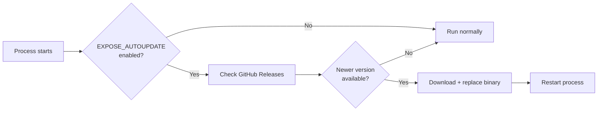

# Auto-Update

expose supports automatic self-update for both the server and client binaries.

## How It Works



When auto-update is enabled:

1. **On startup** - checks for a newer release and updates before proceeding
2. **Periodically** - checks every 30 minutes in the background
3. **On server version change** - if the client detects the server upgraded (via registration response), it triggers an immediate update check

When an update is applied, the binary is replaced in-place and the process restarts automatically.

## Enabling Auto-Update

Set the environment variable:

```bash
export EXPOSE_AUTOUPDATE=true
```

Accepted values: `true`, `1`, `yes` (case-insensitive).

This works for both `expose server` and `expose http` / `expose up`.

### In a systemd service

```ini
[Service]
Environment=EXPOSE_AUTOUPDATE=true
```

> **Note on file capabilities**: If you use `setcap` for binding to privileged ports, those capabilities are lost when the binary is replaced. Use systemd `AmbientCapabilities=CAP_NET_BIND_SERVICE` instead - it survives binary replacement.

## Manual Update

Check for updates and apply interactively:

```bash
expose update
```

This shows the current and available versions, prompts for confirmation (in interactive terminals), then downloads and replaces the binary.

## Hotkey Update (Client)

While the client dashboard is running, press **Ctrl+U** to trigger an immediate update check and apply. The dashboard shows update availability:

```
  Update      v1.2.0 available - run expose update or press Ctrl+U
```

## Development Builds

Auto-update is disabled for development builds (`dev` version or versions ending in `-dev`). This prevents accidental overwrites during development.

## Binary Placement

For auto-update to work, the binary must be in a directory where the running user has **write permission**. The updater creates a temp file, removes the old binary, and writes the new one.

| Placement            | Auto-update works? | Notes                             |
| -------------------- | ------------------ | --------------------------------- |
| `/opt/expose/bin/`   | Yes                | Recommended for systemd services  |
| `./bin/expose`       | Yes                | Local development                 |
| `/usr/local/bin/`    | Only as root       | Not recommended with auto-update  |

## See Also

- [VPS Deployment](vps-deployment.md) - systemd setup with auto-update
- [Client Dashboard](client-dashboard.md) - update notifications in the UI
