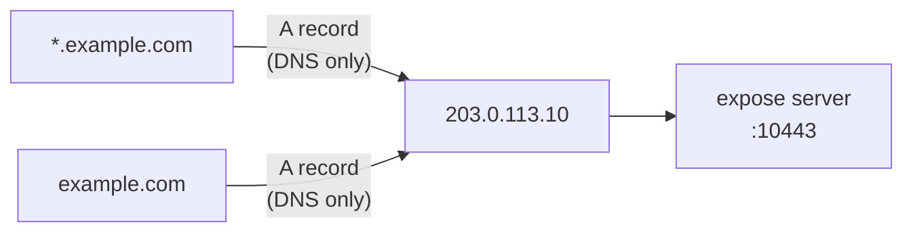

# DNS Setup - Cloudflare

Configure Cloudflare DNS so `example.com` and `*.example.com` resolve to your expose server.

## What you need

| Record   | Type | Name | Value                     |
| -------- | ---- | ---- | ------------------------- |
| Apex     | A    | `@`  | Your server's public IPv4 |
| Wildcard | A    | `*`  | Your server's public IPv4 |

## Steps

1. Log in to [Cloudflare Dashboard](https://dash.cloudflare.com/) → select your domain
2. Go to **DNS** → **Records**
3. Click **Add Record**:

   | Field        | Value                             |
   | ------------ | --------------------------------- |
   | Type         | A                                 |
   | Name         | `@`                               |
   | IPv4 address | `203.0.113.10` _(your server IP)_ |
   | Proxy status | **DNS only** (grey cloud)         |
   | TTL          | Auto                              |

4. Click **Add Record** again:

   | Field        | Value                     |
   | ------------ | ------------------------- |
   | Type         | A                         |
   | Name         | `*`                       |
   | IPv4 address | `203.0.113.10`            |
   | Proxy status | **DNS only** (grey cloud) |
   | TTL          | Auto                      |

5. Save



## Important: Disable Cloudflare Proxy

Set both records to **DNS only** (grey cloud icon), **not** Proxied (orange cloud).

Why:

- expose handles TLS itself (ACME or wildcard certs)
- Cloudflare's proxy would terminate TLS and interfere with ACME HTTP-01 challenges
- Double-proxying adds latency and breaks WebSocket tunnel establishment

## Verify

```bash
dig +short example.com
# → 203.0.113.10

dig +short anything.example.com
# → 203.0.113.10
```

## Notes

- Cloudflare propagation is near-instant for DNS-only records.
- Free plan supports wildcard DNS records.
- If you later want Cloudflare's CDN/WAF, you'd need to use `EXPOSE_TLS_MODE=wildcard` with a static cert and adjust the setup accordingly.
