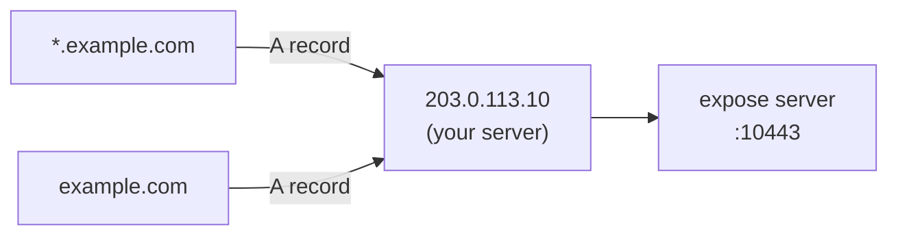

# DNS Setup - GoDaddy

Configure GoDaddy DNS so `example.com` and `*.example.com` point to your expose server.

## What you need

| Record   | Type | Name | Value                     |
| -------- | ---- | ---- | ------------------------- |
| Apex     | A    | `@`  | Your server's public IPv4 |
| Wildcard | A    | `*`  | Your server's public IPv4 |

## Steps

1. Log in to [GoDaddy](https://dcc.godaddy.com/) → **My Products** → select your domain
2. Go to **DNS** → **DNS Records**
3. **Add** or **Edit** the `@` A record:

   | Field | Value                             |
   | ----- | --------------------------------- |
   | Type  | A                                 |
   | Name  | `@`                               |
   | Value | `203.0.113.10` _(your server IP)_ |
   | TTL   | 600 (10 min)                      |

4. **Add** a `*` A record:

   | Field | Value                      |
   | ----- | -------------------------- |
   | Type  | A                          |
   | Name  | `*`                        |
   | Value | `203.0.113.10` _(same IP)_ |
   | TTL   | 600                        |

5. Save changes



## Verify

Wait a few minutes for propagation, then:

```bash
dig +short example.com
# → 203.0.113.10

dig +short test.example.com
# → 203.0.113.10
```

## Notes

- GoDaddy wildcard records cover one level of subdomains only (`foo.example.com` ✓, `bar.foo.example.com` ✗) - this is expected.
- TTL of 600 seconds speeds up initial testing; increase to 3600 once stable.
- If you use GoDaddy's "Forwarding" feature, disable it - it conflicts with A records.
