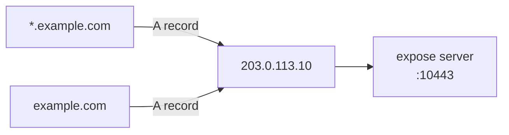

# DNS Setup - Namecheap

Configure Namecheap DNS so `example.com` and `*.example.com` point to your expose server.

## What you need

| Record   | Type | Host | Value                     |
| -------- | ---- | ---- | ------------------------- |
| Apex     | A    | `@`  | Your server's public IPv4 |
| Wildcard | A    | `*`  | Your server's public IPv4 |

## Steps

1. Log in to [Namecheap](https://www.namecheap.com/) → **Domain List** → click **Manage** on your domain
2. Go to **Advanced DNS** tab
3. Under **Host Records**, click **Add New Record**:

   | Field | Value                             |
   | ----- | --------------------------------- |
   | Type  | A Record                          |
   | Host  | `@`                               |
   | Value | `203.0.113.10` _(your server IP)_ |
   | TTL   | Automatic                         |

4. Add another record:

   | Field | Value          |
   | ----- | -------------- |
   | Type  | A Record       |
   | Host  | `*`            |
   | Value | `203.0.113.10` |
   | TTL   | Automatic      |

5. Click the ✓ checkmark to save each record



## Verify

```bash
dig +short example.com
# → 203.0.113.10

dig +short test.example.com
# → 203.0.113.10
```

## Notes

- Make sure the **Nameservers** section is set to **Namecheap BasicDNS** (or your chosen DNS provider). If you're using custom nameservers (e.g. Cloudflare), configure DNS there instead.
- Remove any conflicting URL Redirect or CNAME records for `@` or `*`.
- Propagation typically takes 5–30 minutes.
