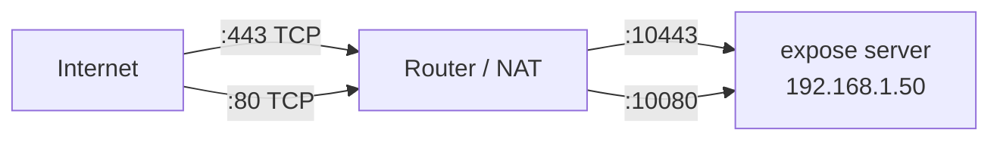

# Port Forwarding

If your expose server runs behind a home router or NAT gateway, you need to forward two ports from your public IP to the server machine.

## Required Ports

| Public Port | Internal Port | Protocol | Purpose                             |
| ----------- | ------------- | -------- | ----------------------------------- |
| **443**     | 10443         | TCP      | HTTPS traffic (tunnelled requests)  |
| **80**      | 10080         | TCP      | ACME HTTP-01 certificate challenges |



## Generic Router Steps

1. Find your server's **local IP** (e.g. `192.168.1.50`):

   ```bash
   # macOS
   ipconfig getifaddr en0

   # Linux
   hostname -I | awk '{print $1}'
   ```

2. Open your router's admin interface (typically `192.168.1.1` or `192.168.0.1`)

3. Navigate to **Port Forwarding** (sometimes under Advanced, NAT, or Virtual Servers)

4. Create two forwarding rules:

   | External Port | Internal IP  | Internal Port | Protocol |
   | ------------- | ------------ | ------------- | -------- |
   | 443           | 192.168.1.50 | 10443         | TCP      |
   | 80            | 192.168.1.50 | 10080         | TCP      |

Where 192.168.1.50 is your server's local IP address.

5. Save and apply

## Common Routers

| Router      | Path to Port Forwarding                          |
| ----------- | ------------------------------------------------ |
| **TP-Link** | Advanced → NAT Forwarding → Virtual Servers      |
| **ASUS**    | WAN → Virtual Server / Port Forwarding           |
| **Netgear** | Advanced → Advanced Setup → Port Forwarding      |
| **Linksys** | Apps & Gaming → Single Port Forwarding           |
| **UniFi**   | Settings → Firewall & Security → Port Forwarding |

## Verify

From an external network (e.g. your phone on mobile data):

```bash
curl -v https://example.com --connect-timeout 5
```

Or use an online port checker to test ports 80 and 443 on your public IP.

## Tips

- **Static local IP**: Assign a static IP or DHCP reservation for your server so the forwarding rules don't break.
- **ISP blocking ports 80/443**: Some ISPs block these ports on residential connections. Contact your ISP or consider a VPS instead (see [VPS Deployment](vps-deployment.md)).
- **Double NAT**: If you're behind two routers (e.g. ISP modem + your router), you need to forward on both, or put the ISP modem in bridge mode.
- **Firewall**: Ensure `ufw`, `iptables`, or macOS firewall allows incoming connections on 10443 and 10080.
