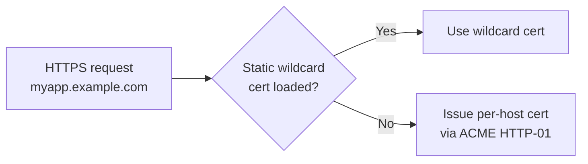
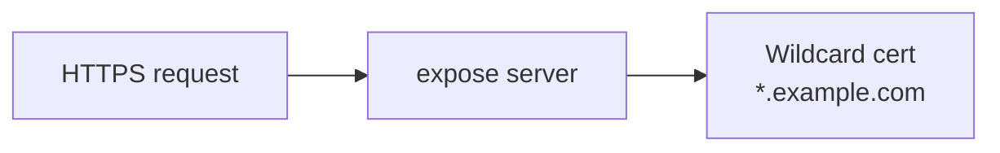
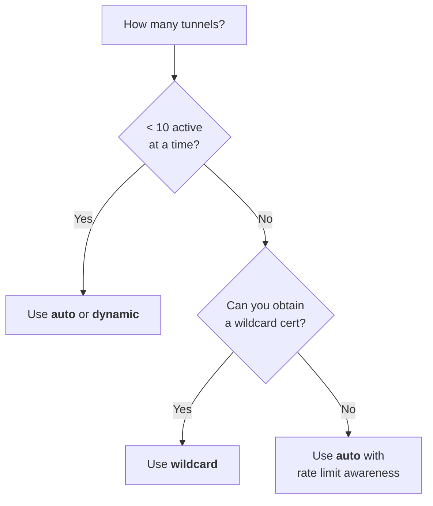

# TLS Modes

expose supports three TLS modes for serving HTTPS. Choose one based on your setup.

## Mode Comparison

| Mode         | Cert issuance                            | Best for                                  | Env value  |
| ------------ | ---------------------------------------- | ----------------------------------------- | ---------- |
| **auto**     | Per-host ACME + optional static wildcard | General use, few tunnels                  | `auto`     |
| **dynamic**  | Per-host ACME only                       | Simple setups, low tunnel churn           | `dynamic`  |
| **wildcard** | Static wildcard cert (no ACME)           | Many short-lived tunnels, offline servers | `wildcard` |

```bash
export EXPOSE_TLS_MODE=auto    # default
```

## auto (default)



- Uses a static wildcard certificate if provided (`EXPOSE_TLS_CERT_FILE` + `EXPOSE_TLS_KEY_FILE`)
- Falls back to per-host ACME for hosts not covered by the wildcard
- Requires ports **80** and **443** publicly reachable for ACME challenges

## dynamic

Identical to `auto` but **ignores** static certificate files. Every host gets its own ACME-issued cert.

- Simpler - no cert files to manage
- Higher cert issuance rate if you have many temporary tunnels
- Let's Encrypt rate limits may apply (50 certs per domain per week)

## wildcard

Uses a pre-obtained wildcard certificate for `*.example.com` and `example.com`. No ACME at all.



- **No** ACME challenge server needed (port 80 not required)
- No per-host certificate delays
- You must obtain and renew the wildcard cert yourself (e.g. via `certbot` DNS-01)

### Obtaining a wildcard cert with certbot

```bash
sudo certbot certonly \
  --manual \
  --preferred-challenges dns \
  -d "example.com" \
  -d "*.example.com"
```

Then configure expose:

```bash
export EXPOSE_TLS_MODE=wildcard
export EXPOSE_TLS_CERT_FILE=/etc/letsencrypt/live/example.com/fullchain.pem
export EXPOSE_TLS_KEY_FILE=/etc/letsencrypt/live/example.com/privkey.pem
```

## Decision Guide



## Environment Variables

| Variable                | Required                                      | Description                      |
| ----------------------- | --------------------------------------------- | -------------------------------- |
| `EXPOSE_TLS_MODE`       | No (default: `auto`)                          | `auto`, `dynamic`, or `wildcard` |
| `EXPOSE_TLS_CERT_FILE`  | Only for `wildcard` / `auto` with static cert | Path to PEM certificate          |
| `EXPOSE_TLS_KEY_FILE`   | Only for `wildcard` / `auto` with static cert | Path to PEM private key          |
| `EXPOSE_CERT_CACHE_DIR` | No (default: `./cert`)                        | ACME cert cache directory        |
