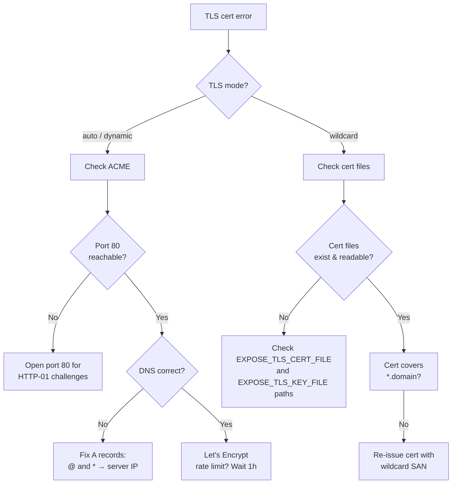

# Troubleshooting

Common issues and how to resolve them.

## Connection refused

**Symptom**: Client shows `connection refused` or `dial tcp: connect: connection refused`.

**Causes & fixes**:

| Check                                 | Fix                                                               |
| ------------------------------------- | ----------------------------------------------------------------- |
| Server not running                    | Start with `expose server`                                        |
| Wrong server URL                      | Verify `expose login` used the correct domain                     |
| Firewall blocking ports               | Open ports 443 and 80 - see [Port Forwarding](port-forwarding.md) |
| Server listening on non-standard port | Forward `443 → 10443` and `80 → 10080`                            |

## Certificate errors

**Symptom**: Browser shows `NET::ERR_CERT_AUTHORITY_INVALID` or client logs TLS handshake failures.



## 401 Unauthorized

**Symptom**: Client gets `401` during tunnel registration.

- API key is invalid or revoked - run `expose apikey list` on the server to check
- Key was created with a different pepper - if `EXPOSE_API_KEY_PEPPER` changed, all old keys are invalid
- Credentials file is stale - re-run `expose login`

## Tunnel registers but no traffic arrives

**Checks**:

1. Is the local app actually running on the expected port?
   ```bash
   curl http://127.0.0.1:3000
   ```
2. Is the DNS wildcard record set? `dig +short yoursubdomain.example.com` should return the server IP.
3. Is the client still connected? Check client logs for `client disconnected; reconnecting`.

## 409 Conflict - Hostname in use

**Symptom**: Client gets `409 Conflict` with error code `hostname_in_use`.

- Another client is already using the requested subdomain (`--domain=myapp`). Named subdomains are exclusive.
- Wait for the other client to disconnect, or choose a different subdomain name.
- If you control both clients and want to swap, disconnect the first client before starting the second.

## 429 Too Many Requests - Active tunnel limit

**Symptom**: Client gets `429 Too Many Requests` with error code `tunnel_limit`.

- Active tunnel limits are configured per API key. By default, API keys have an **unlimited** tunnel limit.
- If a limit has been set for the key in use, the client cannot open more than that number of simultaneous active tunnels.
- List active tunnels or disconnect unused ones.
- Increase the key's tunnel limit or create additional API keys if you need more concurrent tunnels.

## WebSocket disconnects / frequent reconnects

- **Network instability**: Client auto-reconnects with backoff - occasional reconnects are normal.
- **Server ping timeout**: If the client's keepalive pings don't reach the server within 3 minutes, the session is expired. Check for network middleboxes dropping idle connections.
- **Server restart**: Clients reconnect automatically after a server restart.

## ACME rate limits

Let's Encrypt allows **50 certificates per registered domain per week**. If you hit this limit with `auto` or `dynamic` mode:

- Switch to `EXPOSE_TLS_MODE=wildcard` with a pre-obtained wildcard cert
- Use `--domain` to reuse named subdomains instead of generating temporary ones
- Wait for the rate limit window to reset (weekly rolling)

## Debug logging

Enable verbose logs on the server:

```bash
export EXPOSE_LOG_LEVEL=debug
expose server
```

This shows detailed request routing, WebSocket lifecycle, and ACME events.
