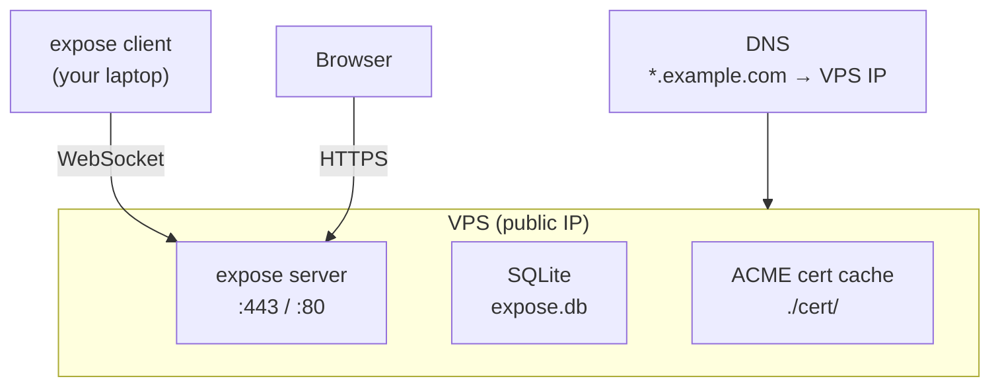

# VPS Deployment

Deploy expose on a cloud VPS (DigitalOcean, Hetzner, AWS Lightsail, etc.) for a reliable, always-on tunnel server.

## Overview



## 1 - Provision a VPS

Any Linux VPS with a public IPv4 works. Minimum specs:

- **1 vCPU, 512 MB RAM** (expose is lightweight)
- Ubuntu 22.04+ / Debian 12+ recommended
- Ports 80 and 443 open in cloud firewall

## 2 - Install expose

SSH into your VPS and build from source:

```bash
# Install Go (if not present)
sudo apt update && sudo apt install -y golang-go git

# Clone and build
git clone https://github.com/koltyakov/expose.git
cd expose
go build -o /usr/local/bin/expose ./cmd/expose
```

Or download a prebuilt binary from the [releases page](https://github.com/koltyakov/expose/releases).

## 3 - Configure DNS

Point your domain to the VPS public IP. See provider-specific guides:

- [GoDaddy](dns-godaddy.md) · [Cloudflare](dns-cloudflare.md) · [Namecheap](dns-namecheap.md)

Required records:

| Type | Name | Value         |
| ---- | ---- | ------------- |
| A    | `@`  | VPS public IP |
| A    | `*`  | VPS public IP |

## 4 - Open firewall ports

```bash
# UFW (Ubuntu/Debian)
sudo ufw allow 80/tcp
sudo ufw allow 443/tcp

# Or for cloud provider firewalls, add inbound rules for ports 80 and 443
```

## 5 - Create a systemd service

```bash
sudo tee /etc/systemd/system/expose.service > /dev/null <<'EOF'
[Unit]
Description=expose tunnel server
After=network.target

[Service]
Type=simple
User=expose
Group=expose
WorkingDirectory=/opt/expose
ExecStart=/usr/local/bin/expose server
Restart=always
RestartSec=5

Environment=EXPOSE_DOMAIN=example.com
Environment=EXPOSE_TLS_MODE=auto
Environment=EXPOSE_LISTEN_HTTPS=:443
Environment=EXPOSE_LISTEN_HTTP_CHALLENGE=:80
Environment=EXPOSE_DB_PATH=/opt/expose/expose.db
Environment=EXPOSE_CERT_CACHE_DIR=/opt/expose/cert
Environment=EXPOSE_API_KEY_PEPPER=<your-secret-pepper>

[Install]
WantedBy=multi-user.target
EOF
```

## 6 - Create user and data directory

```bash
sudo useradd -r -s /usr/sbin/nologin expose
sudo mkdir -p /opt/expose/cert
sudo chown -R expose:expose /opt/expose
```

## 7 - Start the service

```bash
sudo systemctl daemon-reload
sudo systemctl enable expose
sudo systemctl start expose

# Check status
sudo systemctl status expose
sudo journalctl -u expose -f
```

## 8 - Create API key and connect

On the VPS:

```bash
sudo -u expose /usr/local/bin/expose apikey create --name default
```

On your local machine:

```bash
expose login --server example.com --api-key <KEY>
expose http 3000
```

## Cloud-Specific Notes

| Provider          | Firewall                  | Notes                                           |
| ----------------- | ------------------------- | ----------------------------------------------- |
| **DigitalOcean**  | Cloud Firewall or `ufw`   | Droplet firewalls are separate from OS firewall |
| **Hetzner**       | Hetzner Firewall + `ufw`  | Cheapest EU option for low-traffic tunnels      |
| **AWS Lightsail** | Networking tab → Firewall | Simplest AWS option; add ports 80 + 443         |
| **Linode/Akamai** | Cloud Firewall + `ufw`    | Select closest region to your clients           |

## API Key Pepper & Server Migration

> **Important**: If `EXPOSE_API_KEY_PEPPER` is not set explicitly, the server derives a pepper from the machine's `/etc/machine-id` using `sha256("expose-pepper:" + machine-id)`. This pepper is persisted in the SQLite database on first run.

This means:

- **Moving the DB to a different server** (with a different `/etc/machine-id`) without setting `EXPOSE_API_KEY_PEPPER` will cause a pepper mismatch - the new server derives a different pepper, but the DB already has the old one persisted, and the server will reject the mismatch.
- **Reprovisioning a VPS** (new machine-id) with the same DB has the same problem.

To avoid this, **always set `EXPOSE_API_KEY_PEPPER` explicitly** in production:

```bash
# Generate a strong random pepper (do this once, save it securely)
openssl rand -hex 32
```

Then add it to your systemd service or environment:

```bash
Environment=EXPOSE_API_KEY_PEPPER=<output-from-above>
```

With an explicit pepper, the DB is fully portable between servers.

## Backup

The only state file is the SQLite database. Back it up periodically:

```bash
sqlite3 /opt/expose/expose.db ".backup /opt/expose/backup.db"
```

When restoring on a different machine, ensure `EXPOSE_API_KEY_PEPPER` is set to the same value used when the keys were created.

