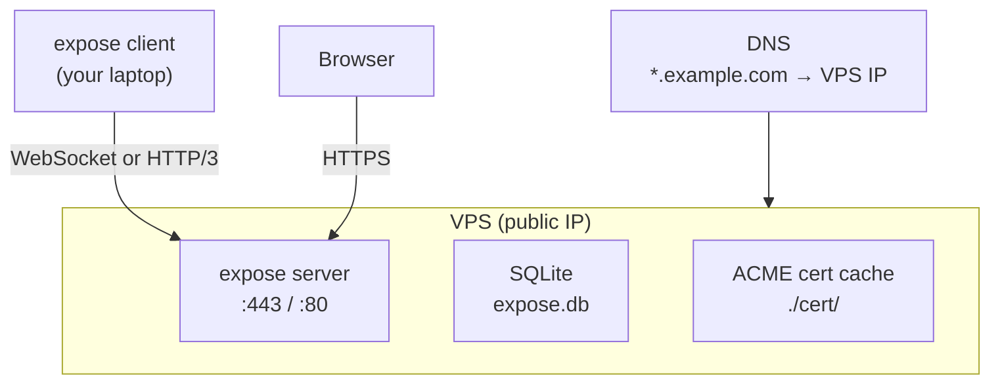

# VPS Deployment

Deploy expose on a cloud VPS (DigitalOcean, Hetzner, AWS Lightsail, etc.) for a reliable, always-on tunnel server.

## Overview


```mermaid
flowchart TB
    subgraph VPS ["VPS (public IP)"]
        Expose["expose server<br/>:443 / :80"]
        DB["SQLite<br/>expose.db"]
        Certs["ACME cert cache<br/>./cert/"]
    end
    DNS["DNS<br/>*.example.com → VPS IP"] --> VPS
    Client["expose client<br/>(your laptop)"] -- "WebSocket or HTTP/3" --> Expose
    Browser["Browser"] -- "HTTPS" --> Expose
```

## 1 - Provision a VPS

Any Linux VPS with a public IPv4 works. Minimum specs:

- **1 vCPU, 512 MB RAM** (expose is lightweight)
- Ubuntu 22.04+ / Debian 12+ recommended
- Ports `80/tcp`, `443/tcp`, and `443/udp` open in cloud firewall

## 2 - Install expose

SSH into your VPS, create the service account and writable installation directories, then run the release installer as that account:

```bash
sudo useradd -r -d /opt/expose -s /usr/sbin/nologin expose
sudo install -d -o expose -g expose /opt/expose /opt/expose/.local/bin /opt/expose/cert
sudo -u expose env HOME=/opt/expose sh -c \
  'curl -fsSL https://raw.githubusercontent.com/koltyakov/expose/main/scripts/install.sh | sh'
```

This installs the prebuilt release to `/opt/expose/.local/bin/expose`. To build from source instead, install **Go 1.26 or newer** and Git, then build entirely through paths writable by the service account:

```bash
sudo -u expose git clone https://github.com/koltyakov/expose.git /opt/expose/src
sudo -u expose env HOME=/opt/expose go -C /opt/expose/src build \
  -trimpath -ldflags "-s -w" -o /opt/expose/.local/bin/expose ./cmd/expose
```

Source builds identify themselves as development versions, so automatic update
checks are disabled for them. Update a source build manually, or use the
prebuilt release installer above when enabling `EXPOSE_AUTOUPDATE` in the
service unit.

> **Important**: The binary must live inside a directory the `expose` service
> user can write to (e.g. `/opt/expose/.local/bin/`). Auto-update needs to create a
> temp file, remove the old binary, and write the new one - all of which
> require directory write permission. Do **not** place it in `/usr/local/bin/`
> unless you run the service as root.

If you are **not** using auto-update, you can optionally set file capabilities
for binding to privileged ports:

```bash
sudo setcap 'cap_net_bind_service=+ep' /opt/expose/.local/bin/expose
```

> **Note**: On Linux, auto-update preserves file capabilities when `getcap` and
> `setcap` are available and permitted. Otherwise, they may need to be
> reapplied after replacement. The systemd `AmbientCapabilities` setting below
> avoids tying the capability to the binary file.

## 3 - Configure DNS

Point your domain to the VPS public IP. See provider-specific guides:

- [GoDaddy](dns-godaddy.md) · [Cloudflare](dns-cloudflare.md) · [Namecheap](dns-namecheap.md)

Required records:

| Type | Name | Value         |
| ---- | ---- | ------------- |
| A    | `@`  | VPS public IP |
| A    | `*`  | VPS public IP |

## 4 - Open firewall ports

```bash
# UFW (Ubuntu/Debian)
sudo ufw allow 80/tcp
sudo ufw allow 443/tcp
sudo ufw allow 443/udp

# Or for cloud provider firewalls, add inbound rules for 80/tcp, 443/tcp, and 443/udp
```

## 5 - Create a systemd service

```bash
sudo tee /etc/systemd/system/expose.service > /dev/null <<'EOF'
[Unit]
Description=expose tunnel server
After=network.target

[Service]
Type=simple
User=expose
Group=expose
WorkingDirectory=/opt/expose
ExecStart=/opt/expose/.local/bin/expose server
Restart=always
RestartSec=5

# Allow binding to privileged ports (80, 443) without root.
# AmbientCapabilities survives self-update binary replacement and
# syscall.Exec restarts, unlike file capabilities set via setcap.
AmbientCapabilities=CAP_NET_BIND_SERVICE
CapabilityBoundingSet=CAP_NET_BIND_SERVICE

Environment=EXPOSE_DOMAIN=example.com
Environment=EXPOSE_TLS_MODE=auto
Environment=EXPOSE_LISTEN_HTTPS=:443
Environment=EXPOSE_LISTEN_HTTP_CHALLENGE=:80
Environment=EXPOSE_DB_PATH=/opt/expose/expose.db
Environment=EXPOSE_CERT_CACHE_DIR=/opt/expose/cert
# Supported for binaries installed from a release, not development builds.
Environment=EXPOSE_AUTOUPDATE=true

[Install]
WantedBy=multi-user.target
EOF
```

## 6 - Start the service

```bash
sudo systemctl daemon-reload
sudo systemctl enable expose
sudo systemctl start expose

# Check status
sudo systemctl status expose
sudo journalctl -u expose -f
```

## 7 - Create API key and connect

On the VPS:

```bash
sudo -u expose /opt/expose/.local/bin/expose apikey create \
  --db /opt/expose/expose.db --name default
```

On your local machine:

```bash
expose login --server example.com --api-key <KEY>
expose http 3000
```

## Cloud-Specific Notes

| Provider          | Firewall                  | Notes                                             |
| ----------------- | ------------------------- | ------------------------------------------------- |
| **DigitalOcean**  | Cloud Firewall or `ufw`   | Droplet firewalls are separate from OS firewall   |
| **Hetzner**       | Hetzner Firewall + `ufw`  | Cheapest EU option for low-traffic tunnels        |
| **AWS Lightsail** | Networking tab → Firewall | Simplest AWS option; add 80/tcp, 443/tcp, 443/udp |
| **Linode/Akamai** | Cloud Firewall + `ufw`    | Select closest region to your clients             |

## Server Secrets & Migration

When `EXPOSE_API_KEY_PEPPER` and `EXPOSE_ACCESS_COOKIE_SECRET` are unset, the server generates cryptographically random values on first use and persists them in SQLite's `server_settings` table. The access-cookie secret falls back to an ephemeral value only if SQLite cannot be read or written.

The persisted values travel with `/opt/expose/expose.db`, so restoring that database on another server preserves API-key validation and form-login sessions. If you explicitly configure `EXPOSE_API_KEY_PEPPER`, it must exactly match the value already persisted in the database or startup fails.

## Backup

The SQLite database contains API keys and persisted server secrets. Back it up periodically:

```bash
sqlite3 /opt/expose/expose.db ".backup /opt/expose/backup.db"
```

When restoring, copy the database and ensure any explicitly configured `EXPOSE_API_KEY_PEPPER` matches its persisted value.
