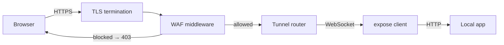

# Web Application Firewall (WAF)

The **expose** server includes a lightweight, built-in Web Application Firewall
that inspects every proxied HTTP request and blocks common attack patterns
before they reach your local application.

## How It Works

The WAF sits in the HTTP handler chain on the server, **after** TLS
termination and **before** the request is forwarded through the WebSocket
tunnel. When a request matches a rule it is immediately rejected with
**403 Forbidden** and a JSON body:

```json
{ "error": "Forbidden" }
```

The blocked request never reaches your local service.

Blocked requests are logged server-side with the matched rule name, method,
URI, remote IP, and User-Agent.

## Enabling / Disabling

The WAF is **enabled by default**. Control it with the environment variable:

```bash
# Disable the WAF
export EXPOSE_WAF_ENABLE=false

# Explicitly enable (default)
export EXPOSE_WAF_ENABLE=true

# Audit-only mode — logs matches but does NOT block requests (dry-run)
export EXPOSE_WAF_AUDIT_ONLY=true
```

> The `/healthz` endpoint is always exempt from WAF inspection regardless of
> this setting.

## Built-in Rules

| Rule                     | Targets Inspected           | Examples                                                                |
| ------------------------ | --------------------------- | ----------------------------------------------------------------------- |
| **SQL Injection**        | Path, query string, headers | `UNION SELECT`, `'; DROP TABLE`, `' OR '1'='1`, `sleep()`, hex literals |
| **XSS**                  | Path, query string, headers | `<script>`, `javascript:`, `onerror=`, `document.cookie`, `eval()`      |
| **Path Traversal**       | Full URI                    | `../../etc/passwd`, `..%2f`, `%00` null bytes                           |
| **Shell Injection**      | Query string, headers       | `$(whoami)`, `` `cmd` ``, pipe to `cat`/`curl`/`bash`                   |
| **Log4Shell / JNDI**     | Path, query string, headers | `${jndi:ldap://…}`, `${jndi:rmi://…}`                                   |
| **Scanner User-Agents**  | User-Agent header           | sqlmap, nikto, nmap, nuclei, zgrab, Burp Suite, wpscan, ffuf, and more  |
| **Header Injection**     | All non-exempt headers      | `\r` or `\n` in header values (CRLF injection)                          |
| **Sensitive File Probe** | URL path                    | `/.env`, `/.git/`, `/wp-admin`, `/etc/passwd`, `/.aws/`, `/.ssh/`       |
| **Protocol Attack**      | Query string, headers       | `<?php`, `<% %>`, `data:…base64`                                        |
| **SSRF**                 | Query string, headers       | `169.254.169.254`, `metadata.google.internal`, `file://`, `gopher://`   |
| **XXE**                  | Query string, headers       | `<!DOCTYPE … [`, `<!ENTITY`, `SYSTEM "file://…"`                        |
| **SSTI**                 | Query string, headers       | `{{config}}`, `{{''.__class__}}`, `<#assign`, `${T(…)}`                 |
| **URI Too Long**         | Request URI length          | URI exceeding 8 KiB (buffer-overflow / smuggling defence)               |
| **Too Many Headers**     | Header count                | More than 64 non-exempt headers (header-stuffing defence)               |

Rules use pre-compiled regular expressions and inspect both raw and
URL-decoded values (including `+` → space decoding and **double-decoded**
values) to defeat encoding-based evasion.

### Inspected Request Parts

Each rule targets one or more of:

- **Path** - the URL path component
- **Query** - the raw query string (decoded variants are also tested)
- **URI** - the full `RequestURI`
- **User-Agent** - the `User-Agent` header
- **Headers** - all header values except a safe-list of structural / browser-controlled headers (e.g. `Host`, `Accept`, `Authorization`, `Content-Type`, WebSocket headers, `Sec-*`)

## Client Dashboard

When the WAF is active the client's terminal dashboard shows:

- **`(+WAF)`** next to the server version, indicating the server has WAF enabled
- A **WAF blocked** counter that updates in real time via keepalive pongs,
  showing how many malicious requests the server has stopped for your tunnel

Example:

```
  Server  v0.9.0 (+WAF)
  …
  WAF blocked  12
```

## Architecture



The WAF middleware is a standard `func(http.Handler) http.Handler` wrapper that
wraps the server's main handler. Rules are evaluated sequentially; evaluation
stops on the first match.

## Performance

- All regex patterns are compiled once at startup.
- The query string is URL-decoded only once per request and reused across all rules.
- Double-decoded variant is computed once and only tested when it differs from
  the single-decoded value.
- Safe headers are skipped via a hash-set lookup.
- Structural limits (URI length, header count) are checked before regex
  evaluation for fast-path rejection.
- Benchmark results typically show sub-microsecond per-request overhead for
  clean traffic.

## Audit-Only Mode

When `EXPOSE_WAF_AUDIT_ONLY=true` is set, the WAF evaluates every rule but
**does not block** matching requests. Instead, it logs the match at WARN level
and calls the `OnBlock` callback so that dashboard counters update as usual.
This is useful for deploying in production first to observe which rules
fire before switching to enforcement mode.

## Limitations

- The WAF applies a **fixed ruleset** - custom rules are not yet supported.
- Only request metadata is inspected (URL, headers, query string). **Request
  bodies are not scanned.**
- The WAF is a defence-in-depth layer, not a replacement for input validation
  and authentication in your application.
