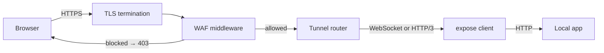

# Web Application Firewall (WAF)

The **expose** server includes a lightweight, built-in Web Application Firewall
that inspects every proxied HTTP request and blocks common attack patterns
before they reach your local application.

## How It Works

The WAF sits in the HTTP handler chain on the server, **after** TLS
termination and **before** the request is forwarded through the WebSocket or
HTTP/3 tunnel. When a request matches a rule it is immediately rejected with
**403 Forbidden** and a JSON body:

```json
{ "error": "Forbidden" }
```

The blocked request never reaches your local service.

Blocked requests are logged server-side with the matched rule name, method,
URI, remote IP, and User-Agent.

## Enabling / Disabling

The WAF is **enabled by default**. Control it with the environment variable:

```bash
# Disable the WAF
export EXPOSE_WAF_ENABLE=false

# Explicitly enable (default)
export EXPOSE_WAF_ENABLE=true

# Audit-only mode — logs matches but does NOT block requests (dry-run)
export EXPOSE_WAF_AUDIT_ONLY=true

# Inspect up to 16 KiB of eligible public request bodies (0 disables)
export EXPOSE_WAF_BODY_INSPECT_LIMIT=16384
```

> The `/healthz` endpoint is always exempt from WAF inspection regardless of
> this setting.

## Built-in Rules

| Rule                     | Targets Inspected                 | Examples                                                                    |
| ------------------------ | --------------------------------- | --------------------------------------------------------------------------- |
| **SQL Injection**        | Path, query string, headers, body | `UNION SELECT`, `'; DROP TABLE`, `' OR '1'='1`, `sleep()`, hex literals     |
| **XSS**                  | Path, query string, headers, body | `<script>`, `javascript:`, `onerror=`, `document.cookie`, `eval()`          |
| **Path Traversal**       | Full URI                          | `../../etc/passwd`, `..%2f`, `%00` null bytes                               |
| **Shell Injection**      | Query string, headers, body       | `$(whoami)`, `` `cmd` ``, pipe to `cat`/`curl`/`bash`                       |
| **Log4Shell / JNDI**     | Path, query string, headers, body | `${jndi:ldap://…}`, `${jndi:rmi://…}`                                       |
| **Scanner User-Agents**  | User-Agent header                 | sqlmap, nikto, nmap, nuclei, zgrab, Burp Suite, wpscan, ffuf, and more      |
| **Header Injection**     | All non-exempt headers            | `\r` or `\n` in header values (CRLF injection)                              |
| **Sensitive File Probe** | URL path                          | `/.env`, `/.git/`, `/.ssh/`, `/.idea/`, `/etc/passwd`, `/proc/self/environ` |
| **Protocol Attack**      | Query string, headers, body       | `<?php`, `<% %>`, `data:…base64`                                            |
| **SSRF**                 | Query string, headers, body       | `169.254.169.254`, `metadata.google.internal`, `file://`, `gopher://`       |
| **XXE**                  | Query string, headers, body       | `<!DOCTYPE … [`, `<!ENTITY`, `SYSTEM "file://…"`                            |
| **SSTI**                 | Query string, headers, body       | `{{config}}`, `{{''.__class__}}`, `<#assign`, `${T(…)}`                     |
| **URI Too Long**         | Request URI length                | URI exceeding 8 KiB (buffer-overflow / smuggling defence)                   |
| **Too Many Headers**     | Header value count                | More than 64 non-exempt header values (header-stuffing defence)             |

Rules use pre-compiled regular expressions and inspect both raw and
URL-decoded values (including `+` → space decoding and **double-decoded**
values) to defeat encoding-based evasion.

Clients can register per-tunnel path prefixes through
`EXPOSE_WAF_IGNORE_PATHS` that bypass only the **Sensitive File Probe** rule.
All other rules continue to inspect those requests, and the exception does not
affect other tunnels. See [Client Configuration](client-configuration.md#per-tunnel-waf-paths).

### Inspected Request Parts

Each rule targets one or more of:

- **Path** - the URL path component
- **Query** - the raw query string (decoded variants are also tested)
- **URI** - the full `RequestURI`
- **User-Agent** - the `User-Agent` header
- **Headers** - all header values except a safe-list of structural / browser-controlled headers (e.g. `Host`, `Accept`, `Authorization`, `Content-Type`, WebSocket headers, `Sec-*`)
- **Body** - up to `EXPOSE_WAF_BODY_INSPECT_LIMIT` bytes of eligible **public** request bodies. URL-encoded form keys and values are normalized and inspected. JSON object keys plus string and numeric values are inspected; encoded variants of JSON string values are normalized. Multipart field names, filenames, form values, and UTF-8 file content are scanned. UTF-8 text/XML-like and `application/octet-stream` payloads are also scanned; non-text binary content is skipped.

Password-like form and JSON fields are inspected like all other keys and values. A password containing a rule-matching value can therefore be blocked.

## Client Dashboard

When the WAF is active, the client's terminal dashboard shows:

- **`WAF: On`** in the metadata next to the server version
- A **`blocked N`** count in the HTTP Requests summary, updated in real time via keepalive pongs

Example:

```
  Server  v0.9.0 (WAF: On, TLS: Dynamic, Transport: WS)
  …
  HTTP Requests      25 total, blocked 12
```

## Architecture


```mermaid
flowchart LR
    Browser -- "HTTPS" --> TLS["TLS termination"]
    TLS --> WAF["WAF middleware"]
    WAF -- "blocked → 403" --> Browser
    WAF -- "allowed" --> Router["Tunnel router"]
    Router -- "WebSocket or HTTP/3" --> Client["expose client"]
    Client -- "HTTP" --> App["Local app"]
```

The WAF middleware is a standard `func(http.Handler) http.Handler` wrapper that
wraps the server's main handler. Rules are evaluated sequentially; evaluation
stops on the first match.

## Performance

- All regex patterns are compiled once at startup.
- The query string is URL-decoded only once per request and reused across all rules.
- Double-decoded variant is computed once and only tested when it differs from
  the single-decoded value.
- Safe headers are skipped via a hash-set lookup.
- Structural limits (URI length, header-value count) are checked before regex
  evaluation for fast-path rejection.
- Re-run `go test ./internal/waf -bench .` after changing rules or body
  inspection limits to measure the actual overhead in your environment.

## Audit-Only Mode

When `EXPOSE_WAF_AUDIT_ONLY=true` is set, the WAF evaluates every rule but
**does not block** matching requests. Instead, it logs the match at WARN level
and calls the `OnBlock` callback so that dashboard counters update as usual.
This is useful for deploying in production first to observe which rules
fire before switching to enforcement mode.

## Limitations

- The WAF applies a **fixed ruleset** - custom rules are not yet supported.
- Body inspection is **bounded**. Only the first
  `EXPOSE_WAF_BODY_INSPECT_LIMIT` bytes of eligible public request bodies are
  scanned. Non-UTF-8 binary file content is skipped, while multipart metadata,
  fields, and UTF-8 file content are inspected.
- The WAF is a defence-in-depth layer, not a replacement for input validation
  and authentication in your application.
